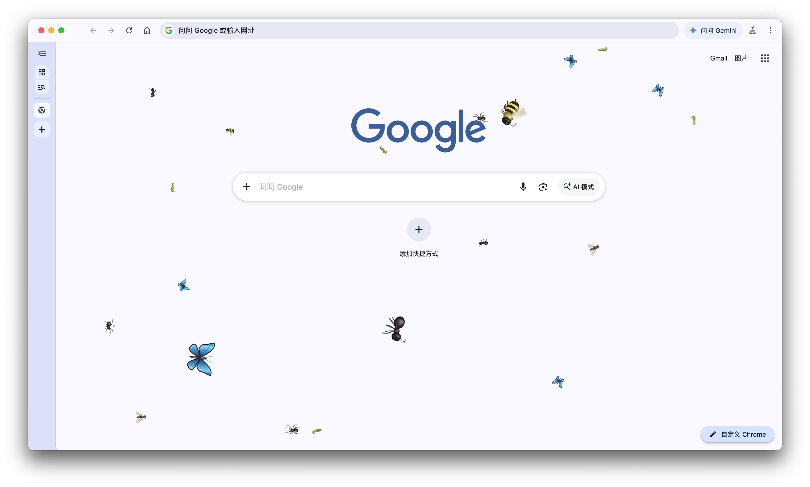
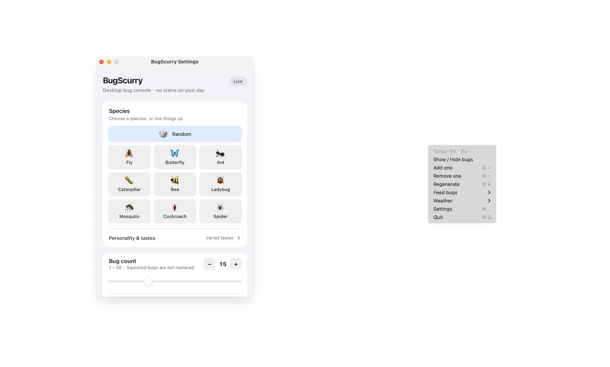

# BugScurry

Desktop bugs that crawl on top of your screen. Click one to squish it.

Cross-platform desktop app for **macOS** and **Windows**. Runs in the background and is controlled from the menu bar / system tray.

[中文文档](README.zh-CN.md)



## Features

- Transparent, borderless, always-on-top desktop overlay (bugs stay visible while settings is open)
- Mouse pass-through by default; only bugs are clickable
- Multiple bugs with independent random motion (crawl, pause, turn, edge-hug)
- Squish on click: flatten animation, optional Web Audio snap, stains, particles
- Four personalities + species favorites for cookie / sugar / fruit feeding
- Day/night species mix; tray weather (five rain intensities plus snow, fog, sandstorm — wind, lightning, ambient sound)
- Settings window: count 1–50, size, speed, randomness, sound/stains/particles, autostart, random weather, random events, multi-monitor, light/dark/auto theme
- Tray / Menu Bar: show-hide, add/remove, regenerate, feed, weather, insecticide spray, settings, quit
- Closing settings does not quit the app
- Squished bugs are **not** auto-replaced (regenerate or raise count to spawn more)
- Overlay follows macOS Mission Control Spaces



## Personalities & feeding

Each bug gets a personality at spawn: shy bugs flee sooner, greedy bugs notice food farther away and wake to eat, lazy bugs move slowly and rest longer, and curious bugs approach the cursor from a distance before fleeing up close. Turning off cursor repellent also disables curiosity toward the cursor.

Use **Tray → Feed bugs → Cookie / Sugar / Fruit**. Up to three snacks can coexist near live bugs; the oldest is replaced on the fourth drop. Food lasts up to 20 seconds and disappears faster while eaten. Each bug chooses by distance and preference; a heart means it is eating its favorite.

- Cookies: cockroaches, spiders
- Sugar: ants, bees, butterflies, mosquitoes
- Fruit: flies, ladybugs, caterpillars

These are playful preferences. The species picker shows each species’ favorite, and its expandable guide explains the personalities. Feeding does not respawn squished or cleared bugs.

Eating styles follow personality: shy bugs peck and bolt, greedy and lazy bugs camp on the snack, curious bugs take short pecks. Species add their own flavor — ants haul crumbs to cover, bees hover while munching, caterpillars ripple, spiders wrap, mosquitoes sip. Nibbling sheds matching crumbs (cookie / sugar spark / fruit drip), and a finished fruit leaves a short juice blot. After a meal bugs keep a brief warm glow — brighter and longer when it was their favorite.

## Time of day & rain

Random mixes follow the local clock: dawn and day favor diurnal species (ants, bees, butterflies, caterpillars, ladybugs), while dusk and night favor nocturnal ones (cockroaches, mosquitoes, spiders). Picking a single species ignores the phase. Flies stay anytime.

**Tray → Weather** offers stop, light / moderate / heavy / downpour / thunderstorm, plus snow, fog, and sandstorm. Rain streaks densify and brighten with intensity; thunder adds lightning; snow drifts slowly; fog is a low-contrast wash; sandstorm uses warm diagonal grit. Bugs slow down and hug edges more in harsh weather (fog is gentler). Weather sound shares the master sound toggle — snow and fog are nearly silent, sand leans on wind noise. Weather is a preference, so it survives restarts.

Turn on **Random weather** in Settings and the app starts and stops weather on its own (about 40s–3min dry, 16–60s wet; downpour, thunder, and sand run a bit shorter). Auto always **rolls a random kind**. A manual tray choice re-arms that schedule instead of fighting it.

## Tech Stack

| Layer | Choice |
|-------|--------|
| Shell | [Tauri 2](https://tauri.app) |
| UI | Vue 3 + TypeScript + Vite |
| Package manager | pnpm |
| Rendering | Canvas 2D |
| Persistence | tauri-plugin-store |
| Autostart | tauri-plugin-autostart |

Why Tauri instead of Electron: see [docs/tech-analysis.md](docs/tech-analysis.md).

## Project Structure

Single source of truth for the file tree. Design rationale and module duties live in [docs/architecture.md](docs/architecture.md) — not duplicated here as another tree.

```text
BugScurry/
├── index.html                 # Overlay webview entry
├── settings.html              # Settings window entry
├── package.json
├── vite.config.ts
├── tsconfig.json
├── tsconfig.node.json
├── LICENSE
├── CHANGELOG.md
├── assets/
│   └── icon-source.png        # App icon source (1024² with HIG padding)
├── docs/
│   ├── README.md              # Doc index (EN)
│   ├── README.zh-CN.md        # Doc index (中文)
│   ├── architecture.md / .zh-CN.md
│   ├── platforms.md / .zh-CN.md
│   ├── requirements.md / .zh-CN.md
│   ├── roadmap.md / .zh-CN.md
│   ├── tech-analysis.md / .zh-CN.md
│   └── screenshots/           # README images
├── qa/                        # Species / weather / event QA page
├── .github/
│   └── workflows/
│       └── ci.yml             # Quality + Windows NSIS + macOS DMG + tag Release
├── src/
│   ├── main.ts
│   ├── vite-env.d.ts
│   ├── App.vue                # Overlay shell (canvas, hit-test, tray)
│   ├── core/
│   │   ├── types.ts
│   │   ├── config.ts
│   │   ├── settings.ts        # Pure settings clamp helpers
│   │   ├── rng.ts
│   │   ├── bug.ts             # Bug entity factory
│   │   ├── bugManager.ts      # Spawn / clear / regenerate / squish / FX
│   │   ├── movement.ts        # Crawl AI
│   │   ├── personality.ts     # Four personalities + eat-style baselines
│   │   ├── feeding.ts         # Food choice / eat plans / carry
│   │   ├── weather.ts         # Day phase, weather profiles, wind, lightning
│   │   ├── atmosphere.ts      # Seamless fog/dust textures + sand gust
│   │   ├── randomEvents.ts    # Random-event clock and pool
│   │   ├── rainAudio.ts       # Procedural rain / wind / thunder audio
│   │   ├── rainTexture.ts     # Offline-built rain streak textures
│   │   ├── renderer.ts        # Canvas draw + squish / stains / particles / rain
│   │   ├── hitTest.ts
│   │   ├── squish.ts
│   │   ├── audio.ts
│   │   ├── loop.ts            # requestAnimationFrame loop
│   │   └── __tests__/         # Vitest unit tests for pure core logic
│   ├── species/
│   │   ├── registry.ts        # Species registry + traits
│   │   ├── drawing.ts         # Shared canvas helpers
│   │   ├── index.ts
│   │   ├── cockroach.ts
│   │   ├── ant.ts
│   │   ├── spider.ts
│   │   ├── fly.ts
│   │   ├── ladybug.ts
│   │   ├── bee.ts
│   │   ├── caterpillar.ts
│   │   ├── butterfly.ts
│   │   └── mosquito.ts
│   ├── settings/
│   │   ├── main.ts
│   │   ├── SettingsApp.vue    # Settings UI
│   │   ├── SpeciesPreview.vue # Live gait popover on species hover
│   │   ├── InfoTip.vue        # ⓘ info popovers
│   │   └── speciesPreviewLayout.ts
│   ├── qa/                    # QA page scripts
│   ├── services/
│   │   ├── tauriBridge.ts     # Overlay ↔ Tauri events / commands
│   │   ├── settingsService.ts # Store, theme, monitor mode
│   │   ├── dailyStatsService.ts # Primary overlay only: kill log + tray stats
│   │   └── __tests__/
│   ├── i18n/
│   │   ├── index.ts
│   │   └── messages.ts        # zh-CN / zh-TW / en / ja / ko
│   └── styles/
│       ├── overlay.css
│       └── settings.css
└── src-tauri/
    ├── Cargo.toml
    ├── build.rs
    ├── tauri.conf.json
    ├── capabilities/
    │   └── default.json
    ├── icons/                 # App + tray icons
    └── src/
        ├── main.rs
        ├── lib.rs             # Windows, cursor poller, monitor fit, commands
        └── tray.rs            # Menu bar / tray menu
```

## Docs

All docs ship in English (`*.md`) and Chinese (`*.zh-CN.md`). Index: [docs/README.md](docs/README.md).

| English | 中文 | Topic |
|---------|------|-------|
| [docs/requirements.md](docs/requirements.md) | [requirements.zh-CN.md](docs/requirements.zh-CN.md) | Requirements |
| [docs/architecture.md](docs/architecture.md) | [architecture.zh-CN.md](docs/architecture.zh-CN.md) | Principles & modules |
| [docs/tech-analysis.md](docs/tech-analysis.md) | [tech-analysis.zh-CN.md](docs/tech-analysis.zh-CN.md) | Tauri vs Electron |
| [docs/roadmap.md](docs/roadmap.md) | [roadmap.zh-CN.md](docs/roadmap.zh-CN.md) | Milestones |
| [docs/platforms.md](docs/platforms.md) | [platforms.zh-CN.md](docs/platforms.zh-CN.md) | Platform notes |
| [AGENTS.md](AGENTS.md) | — | Collaboration rules |

## Development

### Prerequisites

- Node.js 20+
- pnpm 9+
- Rust stable (`rustup`)
- macOS: Xcode Command Line Tools
- Windows: WebView2 Runtime, MSVC Build Tools

### Commands

```bash
pnpm install          # install dependencies
pnpm tauri dev        # run in development (starts Vite on :1420 — required)
pnpm typecheck        # TypeScript check
pnpm test             # unit tests (Vitest)
pnpm build            # frontend production build
pnpm tauri build      # platform installer
```

Use the Tauri CLI for both dev and release. Do **not** run `target/debug/bugscurry` or a bare `cargo build --release` as a substitute — debug loads `http://localhost:1420` and needs Vite; release assets are embedded by `pnpm tauri build`.

### Build outputs

Local `pnpm tauri build` writes to Tauri’s bundle dir:

| Platform | Path |
|----------|------|
| macOS | `src-tauri/target/release/bundle/dmg/` · `macos/` |
| Windows | `src-tauri/target/release/bundle/nsis/` |

CI (GitHub Actions) runs typecheck + tests, `cargo check`, then builds:
- Windows NSIS → artifact `BugScurry-windows-x64`
- macOS DMG (+ app zip) → artifact `BugScurry-macos-arm64`

Pushing a tag `v*` also creates a GitHub Release and attaches those installers. See [CHANGELOG.md](CHANGELOG.md).

```bash
gh workflow run ci.yml
gh run watch <run-id>
gh run download <run-id> -n BugScurry-windows-x64 -D release
gh run download <run-id> -n BugScurry-macos-arm64 -D release
```

### Release checklist

1. Bump `version` in `src-tauri/tauri.conf.json`
2. macOS: signing & notarization (optional for local use)
3. Windows: optional code signing (SmartScreen may warn on unsigned builds)

## Platform notes

| Concern | Approach |
|---------|----------|
| Mouse pass-through | Default `ignore_cursor_events`; enable only when hovering a bug |
| Hit-test coords | macOS: CGEvent points; Windows: physical pixels |
| Retina / DPI | Logical viewport from CSS `innerWidth` + `devicePixelRatio` |
| Multi-monitor | One overlay window per display when “all screens” |
| Mission Control Spaces | `visibleOnAllWorkspaces` on overlays |

## License

See [LICENSE](LICENSE).
