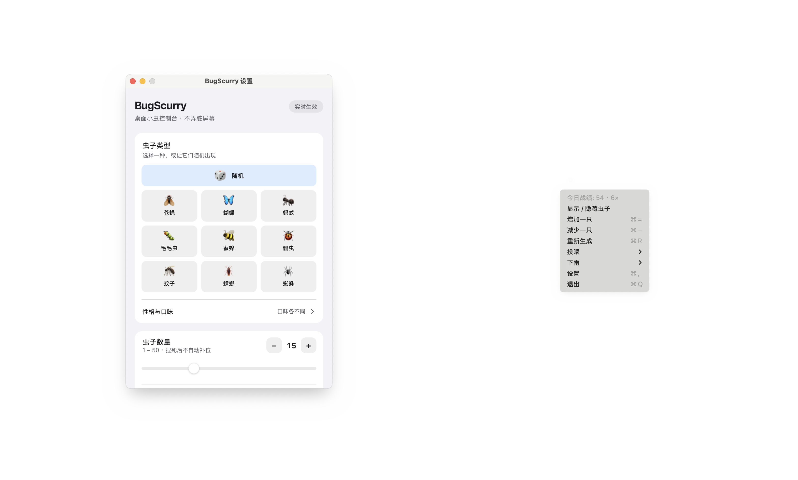

# BugScurry

桌面小虫宠物：透明覆盖层上自由爬行，点击即可「捏死」。

支持 **macOS** 与 **Windows**，以后台常驻为主，通过菜单栏 / 系统托盘控制。

[English](README.md)


## 功能

- 透明、无边框、始终置顶的桌面覆盖层（打开设置时虫子仍可见）
- 默认鼠标穿透，仅虫子区域可点击
- 多只虫独立随机运动：爬行、停顿、转向、沿边缘游走
- 点击捏死：压扁动画、可选 Web Audio 音效、痕迹与粒子
- 四种性格 + 虫种最爱（饼干 / 糖 / 水果）投喂
- 日夜虫相；托盘天气（五档雨 / 雪 / 雾 / 沙尘，风向、闪电、环境声）
- 设置：数量 1–50、大小、速度、随机度、音效/痕迹/粒子、开机启动、随机天气、随机事件、多显示器、浅色/深色/自动主题
- 托盘 / Menu Bar：显示隐藏、增减、重新生成、投喂、天气、喷雾杀虫剂、设置、退出
- 关闭设置不会退出应用
- **捏死后不自动补位**（增加数量或点「重新生成」才会再出虫）
- 覆盖层跟随 macOS 多桌面（Mission Control Spaces）



## 性格与投喂

每只虫子出生时会随机获得一种性格：胆小的更早逃跑；贪吃的能察觉更远处的食物，也会提前结束休息去吃；慵懒的移动更慢、休息更久；好奇的会远远试探光标，太近时仍然逃跑。关闭「怕光逃跑」也会关闭对光标的好奇行为。

通过 **托盘 → 投喂 → 饼干 / 糖 / 水果** 操作。食物落在活虫附近，最多同时保留三份，第四份会替换最早的一份。食物最多保留 20 秒，被啃食时更快消耗。虫子会结合距离和口味挑选食物，吃到最爱时冒出小爱心。

- 饼干：蟑螂、蜘蛛
- 糖：蚂蚁、蜜蜂、蝴蝶、蚊子
- 水果：苍蝇、瓢虫、毛毛虫

这些是趣味玩法口味。设置页选择虫种后会显示最爱食物，展开「性格与口味」可查看说明。投喂不会补回捏死或清除的虫子。

吃相随性格变化：胆小啄两口就溜，贪吃和慵懒会趴在食物上，好奇的短啄再绕开。虫种还有各自吃法：蚂蚁叼着碎屑往墙角搬，蜜蜂悬停抖着吃，毛毛虫身体起伏慢啃，蜘蛛像在缠食，蚊子/苍蝇小口快吸。啃食时会掉出对应碎屑（饼干渣 / 糖闪光 / 果汁），水果吃完会在桌面留一小滩淡印。吃完后虫子会短暂发暖光，吃到最爱时更亮、更久。

## 时段与下雨

随机混养会按本机时钟偏好虫种：清晨和白天更常见昼行的蚂蚁、蜜蜂、蝴蝶、毛毛虫、瓢虫；黄昏和夜晚更常见夜行的蟑螂、蚊子、蜘蛛。手动选定单一虫种时不受时段影响。苍蝇全天出没。

**托盘 → 天气** 可选择停天气，或指定小雨 / 中雨 / 大雨 / 暴雨 / 雷阵雨 / 雪 / 雾 / 沙尘。雨丝按强度变密变亮，风向每次开场重掷；雷阵雨有双次闪电与雷声；雪缓落、雾为低对比雾带、沙尘为斜向暖色粒子。虫子会按强度减速、更爱歇脚、贴向最近的边缘躲雨（雾影响较轻）。环境声与「捏死音效」共用总开关；雪/雾几乎无声，沙尘偏风声。天气是持久偏好，重启后仍生效。

设置里打开 **随机天气** 后，应用会按自己的节奏自动开/停天气（干期约 40 秒–3 分钟，湿期约 16–60 秒，暴雨/雷阵雨/沙尘略短）；**自动永远随机抽档**。托盘手动选择会重置这段节奏，不会被立刻顶回去。

## 技术栈

| 层 | 选型 |
|----|------|
| 桌面壳 | [Tauri 2](https://tauri.app) |
| 前端 | Vue 3 + TypeScript + Vite |
| 包管理 | pnpm |
| 渲染 | Canvas 2D |
| 持久化 | tauri-plugin-store |
| 自启动 | tauri-plugin-autostart |

选型对比见 [docs/tech-analysis.md](docs/tech-analysis.md)。

## 项目结构

目录树**只在这里维护**（唯一来源）。设计原则与模块职责见 [docs/architecture.zh-CN.md](docs/architecture.zh-CN.md)，不再重复画树。

```text
BugScurry/
├── index.html                 # 覆盖层 Web 入口
├── settings.html              # 设置窗口入口
├── package.json
├── vite.config.ts
├── tsconfig.json
├── tsconfig.node.json
├── LICENSE
├── CHANGELOG.md
├── assets/
│   └── icon-source.png        # 应用图标源图（1024²，已按 HIG 留白）
├── docs/
│   ├── README.md              # 文档索引（英文）
│   ├── README.zh-CN.md        # 文档索引（中文）
│   ├── architecture.md / .zh-CN.md
│   ├── platforms.md / .zh-CN.md
│   ├── requirements.md / .zh-CN.md
│   ├── roadmap.md / .zh-CN.md
│   ├── tech-analysis.md / .zh-CN.md
│   └── screenshots/           # README 配图
├── qa/                        # 虫种 / 天气 / 事件 QA 页入口
├── .github/
│   └── workflows/
│       └── ci.yml             # 质量检查 + Windows NSIS + macOS DMG + tag 发布
├── src/
│   ├── main.ts
│   ├── vite-env.d.ts
│   ├── App.vue                # 覆盖层外壳（画布、命中、托盘）
│   ├── core/
│   │   ├── types.ts
│   │   ├── config.ts
│   │   ├── settings.ts        # 设置裁剪纯函数
│   │   ├── rng.ts
│   │   ├── bug.ts             # Bug 实体
│   │   ├── bugManager.ts      # 生成 / 清除 / 重生 / 捏死 / 特效
│   │   ├── movement.ts        # 爬行 AI
│   │   ├── personality.ts     # 四种性格与吃相基线
│   │   ├── feeding.ts         # 选食 / 进食计划 / 搬运
│   │   ├── weather.ts         # 时段权重、天气 profile、风向、闪电
│   │   ├── atmosphere.ts      # 无缝雾/尘纹理与沙尘阵风
│   │   ├── randomEvents.ts    # 随机事件时钟与事件池
│   │   ├── rainAudio.ts       # 程序化雨/风/雷声
│   │   ├── rainTexture.ts     # 离线雨丝纹理
│   │   ├── renderer.ts        # 绘制 + squish / 痕迹 / 粒子 / 雨
│   │   ├── hitTest.ts
│   │   ├── squish.ts
│   │   ├── audio.ts
│   │   ├── loop.ts            # rAF 主循环
│   │   └── __tests__/         # 核心纯逻辑 Vitest 单测
│   ├── species/
│   │   ├── registry.ts        # 虫种注册表
│   │   ├── drawing.ts         # 公共绘制辅助
│   │   ├── index.ts
│   │   ├── cockroach.ts
│   │   ├── ant.ts
│   │   ├── spider.ts
│   │   ├── fly.ts
│   │   ├── ladybug.ts
│   │   ├── bee.ts
│   │   ├── caterpillar.ts
│   │   ├── butterfly.ts
│   │   └── mosquito.ts
│   ├── settings/
│   │   ├── main.ts
│   │   ├── SettingsApp.vue    # 设置界面
│   │   ├── SpeciesPreview.vue # 虫种悬停步态预览
│   │   ├── InfoTip.vue        # ⓘ 说明弹层
│   │   └── speciesPreviewLayout.ts
│   ├── qa/                    # QA 页脚本
│   ├── services/
│   │   ├── tauriBridge.ts     # 覆盖层 ↔ Tauri 事件/命令
│   │   ├── settingsService.ts # 配置存储、主题、多屏
│   │   ├── dailyStatsService.ts # 主覆盖层独占：击杀落盘与托盘战绩
│   │   └── __tests__/
│   ├── i18n/
│   │   ├── index.ts
│   │   └── messages.ts        # 简体 / 繁體 / English / 日本語 / 한국어
│   └── styles/
│       ├── overlay.css
│       └── settings.css
└── src-tauri/
    ├── Cargo.toml
    ├── build.rs
    ├── tauri.conf.json
    ├── capabilities/
    │   └── default.json
    ├── icons/                 # 应用与托盘图标
    └── src/
        ├── main.rs
        ├── lib.rs             # 窗口、光标轮询、多屏适配、命令
        └── tray.rs            # 菜单栏 / 托盘菜单
```

## 文档

所有文档均提供英文（`*.md`）与中文（`*.zh-CN.md`）。索引：[docs/README.zh-CN.md](docs/README.zh-CN.md)（英文：[docs/README.md](docs/README.md)）。

| 中文 | English | 内容 |
|------|---------|------|
| [docs/requirements.zh-CN.md](docs/requirements.zh-CN.md) | [requirements.md](docs/requirements.md) | 需求与验收 |
| [docs/architecture.zh-CN.md](docs/architecture.zh-CN.md) | [architecture.md](docs/architecture.md) | 原则与模块职责 |
| [docs/tech-analysis.zh-CN.md](docs/tech-analysis.zh-CN.md) | [tech-analysis.md](docs/tech-analysis.md) | Tauri vs Electron |
| [docs/roadmap.zh-CN.md](docs/roadmap.zh-CN.md) | [roadmap.md](docs/roadmap.md) | 里程碑 |
| [docs/platforms.zh-CN.md](docs/platforms.zh-CN.md) | [platforms.md](docs/platforms.md) | 平台说明 |
| [AGENTS.md](AGENTS.md) | — | 协作与开发规范 |

## 开发

### 环境要求

- Node.js 20+
- pnpm 9+
- Rust stable（`rustup`）
- macOS：Xcode Command Line Tools
- Windows：WebView2 Runtime、MSVC Build Tools

### 命令

```bash
pnpm install          # 安装依赖
pnpm tauri dev        # 开发运行（会启动 Vite :1420，必须先有它）
pnpm typecheck        # TypeScript 检查
pnpm test             # 单元测试（Vitest）
pnpm build            # 前端生产构建
pnpm tauri build      # 打包安装包
```

开发与发布都请走 Tauri CLI。不要单独跑 `target/debug/bugscurry`，也不要只用 `cargo build --release` 当发布产物：debug 会连 `http://localhost:1420`（依赖 Vite），生产资源由 `pnpm tauri build` 嵌入。

### 打包产物

本地 `pnpm tauri build` 输出在 Tauri 默认 bundle 目录：

| 平台 | 路径 |
|------|------|
| macOS | `src-tauri/target/release/bundle/dmg/` · `macos/` |
| Windows | `src-tauri/target/release/bundle/nsis/` |

CI（GitHub Actions）会跑 typecheck + 测试、`cargo check`，并构建：
- Windows NSIS → Artifact `BugScurry-windows-x64`
- macOS DMG（及 app zip）→ Artifact `BugScurry-macos-arm64`

推送 `v*` 标签时还会创建 GitHub Release 并挂上安装包。变更记录见 [CHANGELOG.md](CHANGELOG.md)。

```bash
gh workflow run ci.yml
gh run watch <run-id>
gh run download <run-id> -n BugScurry-windows-x64 -D release
gh run download <run-id> -n BugScurry-macos-arm64 -D release
```

### 发布前检查

1. 更新 `src-tauri/tauri.conf.json` 中的 `version`
2. macOS：可选签名与公证
3. Windows：可选代码签名（未签名可能被 SmartScreen 拦截）

## 平台说明

| 事项 | 做法 |
|------|------|
| 鼠标穿透 | 默认忽略光标；悬停虫子时才接收点击 |
| 命中坐标 | macOS：CGEvent 逻辑点；Windows：物理像素 |
| Retina / DPI | 视口用 CSS `innerWidth` + `devicePixelRatio` |
| 多显示器 | 「所有屏幕」时每台一个覆盖层窗口 |
| 多桌面 Spaces | 覆盖层 `visibleOnAllWorkspaces` |

## License

见 [LICENSE](LICENSE)。
